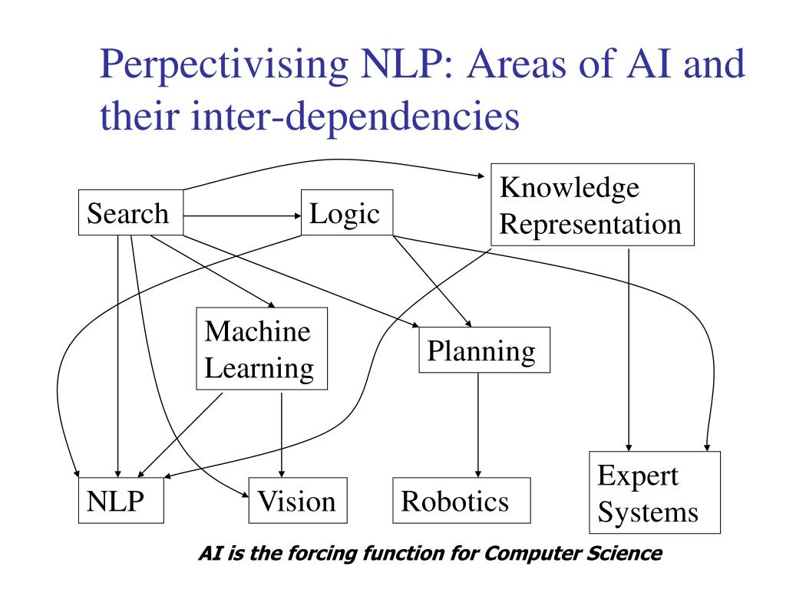
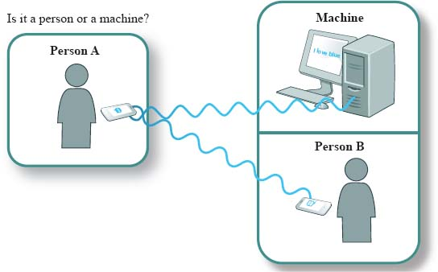

## Day 1 - 14th Feb, 2022

Started learning Natural Language Processing (NLP). 

### Introduction to NLP

#### Areas of AI & their inter-dependencies

The aim of AI in the recent times have been to make the machines as closer to humans as possible. There are many areas of AI and they have inter-dependencies when we consider the entire task of _making a machine behave like a human_ as a whole. We start from the lowermost layer and go all the way up to understand the following dependency graph. 

 

* NLP: NLP is concerned with the computer being able to process human-like languages like English, French, Hindi, Marathi, etc. 

* Vision: In Computer Vision (CV), the computer understands visual scenes and understands what's happening in the surroundings. Based on this info, it can take certain decisions on how to operate in the given scenario. 

* Robotics: In Robotics, there is an embedded software that performs various actions like locomotion, monitoring surroundings, responding to audio signals, picking up supplies, etc.

* Expert Systems: It is concerned with the expert level performance of a software on a specific task. Eg. The task could be diagnosis of a disease & suggest cure if possible. A doctor operates with a large number of rules which he/she has obtained from years of education & practice to do the same task. 

These all human-like systems are fed by blocks in the second layer. 

* Machine Learning: This is a domain where the machine learns the knowledge contained in the data. Eg. In today's internet world, we have a huge amount of text. It is important to learn the data contained in it, so that the machine could understand the text when given the next time. 

* Planning: This area is concerned with making strategies or action sequences that are required for execution of tasks by autonomous robots & unmanned vehicles. Typically a robot/vehicle needs to carry out multiple decisions at the same time. So this area of AI concerns with the automated scheduling of the decisions to carry out the task in the optimal manner. Hence, planning is mostly concerned with robotics & not with NLP. 

First layer blocks: 

* Search: In search, the machine is faced with a number of choices. Search algos try to find out the best possible strategy for the machine. Eg. In NLP, the text goes like "I went to the bank to withdraw some money". Here, "bank" word has two meanings - (a) the financial institute (b) the land alongside the lake or river. Out of these two, which meaning should the computer pick? This decision making process requires search. 

* Logic: Logic is the formal representation of the rules we follow to make the inference. Eg. The knowledge gathered from the text needs to be strutured in a logical form or certain set of rules to derive the meaning from it. Propositional Calculus, Predicate Calculus and some other forms of non-monotonic logic are used in NLP for this. 

* Knowledge-Representation: Machines only understand binary. However, in NLP type of area of AI, we deal with words. The task here is to convert the sentence in the form of numbers such that the numeric data still somehow contains the meaning which the textual data was containing. 

#### Goals of NLP

* Science Goal: Understand the way language operates for machines.
* Engineering Goal: Build the systems that analyse & generate language, thereby reducing the man-machine gap. 

#### History of NLP

It all starts from Turing proposing "The Turing Test". Turing proposed "The Imitation Game" in 1950, to test if the machine is truly intelligent or not. The test is - Person A in one room needs to communicate via keyboard to two responders in two rooms, one containing the Person B and other containing the Machine. Person A will ask questions and if he is unable to identify which room has the Machine via the answers he/she gets, then Machine has successfully imitated a Person & is considered as truly intelligent.   

 

In 1966, Joseph Weizenbaum created a program which appeared to pass the Turing test. The program, known as ELIZA, worked by examining a user's typed comments for keywords. If a keyword is found, a rule that transforms the user's comments is applied, and the resulting sentence is returned. If a keyword is not found, ELIZA responds either with a generic riposte or by repeating one of the earlier comments.

You can interact with ELIZA here: http://psych.fullerton.edu/mbirnbaum/psych101/eliza.htm 

John Searle's 1980 paper Minds, Brains, and Programs proposed the "Chinese room" thought experiment and argued that the Turing test could not be used to determine if a machine can think. Searle noted that software (such as ELIZA) could pass the Turing test simply by manipulating symbols of which they had no understanding. Without understanding, they could not be described as "thinking" in the same sense people are. Therefore, Searle concludes, the Turing test cannot prove that a machine can think.

Arguments such as Searle's and others working on the philosophy of mind sparked off a more intense debate about the nature of intelligence, the possibility of intelligent machines and the value of the Turing test that continued through the 1980s and 1990s.

The Loebner Prize provides an annual platform for practical Turing tests with the first competition held in November 1991. It is underwritten by Hugh Loebner. The Cambridge Center for Behavioral Studies in Massachusetts, United States, organised the prizes up to and including the 2003 contest. As Loebner described it, one reason the competition was created is to advance the state of AI research, at least in part, because no one had taken steps to implement the Turing test despite 40 years of discussing it.

The silver (text only) and gold (audio and visual) prizes have never been won. However, the competition has awarded the bronze medal every year for the computer system that, in the judges' opinions, demonstrates the "most human" conversational behaviour among that year's entries. 

Artificial Linguistic Internet Computer Entity (A.L.I.C.E.) has won the bronze award on three occasions in recent times (2000, 2001, 2004). Learning AI Jabberwacky won in 2005 and 2006.

#### Stages of Language Processing

What makes NLP so challenging is the ambiguity. But before deep diving into how to work around ambiguity, we need to understand the stages of language processing. There are in all 7 stages, as mentioned below.

* Phonetics & Phonology
* Morphology
* Lexical Analysis
* Syntactic Analysis
* Semantic Analysis
* Pragmatics
* Discourse

**Phonetics**

This stage is concerned with processing of speech. 

Challenges in this stage are: 

* Homophones: bank (finance term) vs. bank (land alongside river)
* Word Boundary: "aajayenge" in Hindi, can be interpreted in two ways. "aa jayenge" - meaning "will come" vs. "aaj ayenge" - meaning "will come today". "I got a plate" in English, can be interpreted in two ways again: "I got a plate" vs. "I got up late". 
* Disfluency: _ah_, _um_, _ahem_, etc. which a user utters while speaking. These words have no meaning, it just allows user to gain time to organize his thoughts. 

**Morphology**

This stage is concerned with word formation rules from the root words. 

Challenges in this stage are: 

Using the root word, we can create other word in different contexts. 

* Singular-Plural conversion: Eg. boy -> boys
* Male-Female conversion: Eg. Tzar -> Tzarina
* Tense conversion: Eg. stretch -> stretched
* Modality conversion: Eg. "Khaana" (food/noun) -> "Khaiye" (requesting to eat food/verb)

We need to work with all the different forms of the same root word. There are morphologically rich languages like Dravidian (South-Indian languages), Hungarian, Turkish, etc. and morphologically poor languages like Chinese, English, etc. Languages with rich morphology have an advantage of easier processing at higher levels & thus, of our particular interest.

**Lexical Analysis**

This refers to the dictionary access and obtaining the properties of the word. 

For example, when the input "Dog" is given as word, we get the output as - 
* noun (lexical property)
* append 's' to make plural (morph property) 
* It is a 4-legged carnivorous animal (semantic property) 

Dictionary/Lexicon forms the heart of the NLP. Suppose the input given was "Dogs are running". If it was a speech signal, phoetics stage will process it and convert it in text format. Now in morphological stage, this text goes. From the word "Dogs", the root word is extracted by removing prefixes & suffixes. So here "s" is stripped to get the root word "dog". Similarly, "running" word will get converted to its root form "run". These roots are proceeded for further analysis. Since we are eliminating some very important details like plural form of the noun, tense of the verb, etc. during morph analysis, we need to have a lexicon that stores these properties. So that in future, we can use these properties to present the output in a better way. 

The main challenge in Lexical Analysis is _"Word Sense Disambiguation"_. 

* Part of Speech (PoS) Disambiguation: Same word can be used as different part of speech. Eg. "_Love_ is in the air." (noun) vs. "I _love_ you." (verb)

* Sense Disambiguation: Same word can be used in two different meanings. Eg. "I deposited my paycheck at the _bank_." vs. "The children are playing near the _bank_." Another example, "That coal _mine_ is _mine_."

* Metonymy/ Word relationships: When a word is substituted for another word but still implying the same meaning. Eg. "_The chair_ emphasized the need for adult education.", "The entire _auditorium_ was in awe.", "That's a _ground-breaking_ research.", etc. Here, we know that it is not the chair (the wooden item) but the person/set of persons in authority who emphasized on the adult education. Similarly, it is not the auditorium which was in awe, but the audience in the auditorium. And we make such name-changes casually during conversations. 

**Syntactic Analysis**

Uptil now, we have processed the words. Now we come at the stage where we need to process phrases and sentences. 

In the following image, sentence S is broken in a tree-structure. The sentence is divided into two parts - noun phrase (NP) and verb phrase (VP). VP can be further divided into smaller VP & preposition phrase (PP). 

Challenges in the syntactic processing are related to the structural ambiguity. 

* Scope: We need to know for how long in a sentence the scope of the word is valid. Eg. "The old men and women were taken to safe locations." Here the ambiguity is "(old men and women)" - meaning both men & women which are old vs. "((old men) and women)" - meaning men which are old and all women. Here is one more example, in which different scoping can completely reverse the meaning of the sentence. "No smoking areas will allow Hookas inside." In this "(No) (smoking areas)" - meaning all smoking areas will prohibit Hookas vs. "(No smoking areas)" - meaning no-smoking areas will permit Hookas. 

* Preposition Phrase Attachment: Here there is an ambiguity of determining _to which noun in the sentence, the preposition phrase belongs to._ Eg. "I saw the boy with a telescope." Here the ambiguity is - _who has the telescope?_ However the similar sentence, "I saw the mountain with a telescope." is unambiguous because mountain can't use the telescope; so it is definitely me having the telescope. Another example is, "After 20 years, Government paid 20 lakhs to father for causing son's death." Here the ambiguity is - _who was responsible for son's death?_ We know it was the government in this case because the other meaning is unacceptable. However, there is no stopping from attaching that phrase to father as well. Few more are: "The cameraman shot the man with the gun when he was near Kennedy.", "Aid for kins of cops killed in terrorist attacks.", etc. 

**Semantic Analysis**

This involves the representation of the sentence tree in terms of predicate calculus, semantic nets, frames, conceptual dependencies or scripts. This stage starts creating the knowledge representation of the sentence. 

Eg. Consider the sentence "John gave a book to Mary." Here, the information of this sentence can be decomposed into following way: {Action: Give, Agent (i.e. who is performing the action): John, Object: Book, Recipient: Mary}.

The challenge in semantic analysis is mainly in ambiguous semantic role labelling. 

* Semantic Role Labelling: Consider the sentence "Visiting aunts can be a nuisance.". The sentence can be interpreted in two ways. First is, _aunts who are coming to visit are nuisance._ In this case, {Action: Visit, Agent: Aunt, Object: The visitor}. Second is, _we are visiting aunts and the visits are nuisance._ In this case, {Action: Visit, Agent: The visitor, Object: Aunts}. An example in Hindi, "aapko mujhe mithai khilaani padegi." Here the action is "khilaana" - to make someone eat. But the ambiguity is still there - _who is asking whom to eat the sweets? Am I saying that I ought to make you eat the sweets? Or you are ought to make me eat the sweets?_ This is unclear. 

**Pragmatics**

This is a very hard problem in NLP. The goal of pragmatics is to understand the hidden meaning intended by the speaker but not directly expressed in words. 

Eg. Consider the following piece of conversation. 

* Tourist (in a hurry, checking out of the hotel, calling the service boy): _Hey boy! Please go upstairs and see if my shoes are still there in the room. Don't be late for I have to catch the train in 15 minutes._
* Service boy (ran upstairs & came down panting): _Yes Sir, they are there._

From the above piece of conversation we know that the tourist wanted the service boy to bring those shoes if they are there, however he didn't expressed that explicitly. That intention was hidden. So technically the service boy gave the right answer and did as instructed. Understanding the hidden intention is the pragmatics part. 

Another example could be, asking your friend "Is there any water left in your bottle?" The intention is not to ask if there is water in the bottle or not, but surely you want to have that water and hence, it is a request instead. If your friend just answers yes or no and then does nothing, then there is a pragmatics failure. 

**Discourse**

This is concerned with the processing of sequence of sentences. So far, our analysis was restricted to only one sentence.  

Eg. Consider the following conversation.

* Mother: _John, Go to school. It is open today. You shouldn't bunk. Father will be very angry._

In this sequence of sentences, if we consider each single sentence as separate entity, there are so many things which are ambiguous. Eg. _What is open today?, Who is the mother addressing with 'you'? What should I not bunk? Why will the father be angry? Does father here mean 'a parent' or 'the headmaster'?_ 

So here the ambiguity is resolved when we consider the sequence/chain of sentences. 

Another example could be, "_John was returning from the school dejected. Today was his math test._" Here, the reasoning lies after the sentence unlike in the previous example. 

In the next sessions, we will learn about NLP and how we can work to resolve the above mentioned challenges. 

